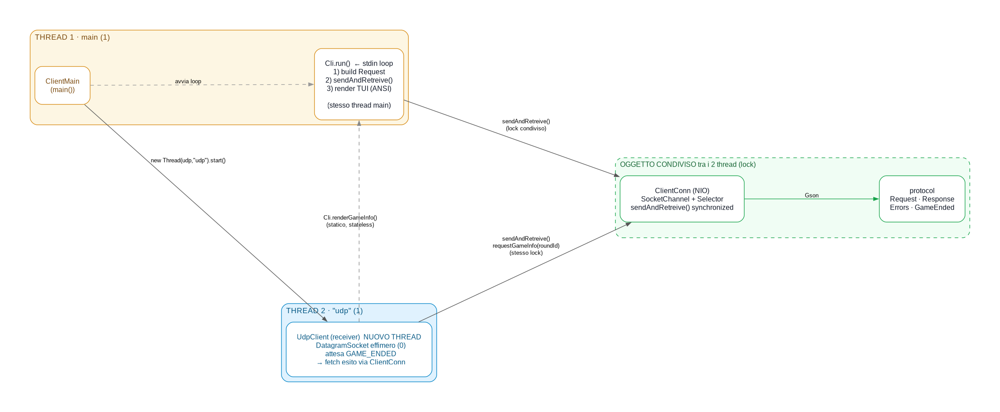

# `Cli` — loop CLI + render delle risposte (resa TUI)

## Architettura (client)

Il client si compone di 4 nodi orchestrati da `ClientMain`: `Cli` (loop + resa
TUI), `ClientConn` (TCP NIO, `sendAndRetreive()` synchronized), `UdpClient`
(receiver notifiche), tutti collegati ai POJO condivisi di `protocol`
(`Request`/`Response`/`Errors`/`GameEnded`). Le risposte vengono riconvertite
dal payload **`Object`** al POJO dell'operazione (`protocol.payload.*`) via un
helper `payload(Response, Class)`. Il `UdpClient` riusa
`ClientConn` per il fetch dell'esito (anti-TOCTOU) e `Cli.renderGameInfo`
(statico) per la stampa.

## Ruolo
Loop di sinistra su stdin: legge un comando, lo traduce in una `Request`
(GSON/`client`), invia via `ClientConn` e renderizza la `Response`. **Stateless
per-call**: lo stato del gioco è sul server; la CLI ridisegna ogni risposta.

## Resa TUI (nessuna dipendenza)
L'output usa **colori ANSI** (`\u001b[...m`) e **cornici box-drawing**
(`┌─┐│└┘`) **solo su stdout di console**. I codici ANSI sono innocui se il
terminale non li supporta (appaiono come sequenze grezze). NB: mai `.trim()` su
stringhe che contengono ESC iniziale (`U+001B ≤ U+0020`): spezzerebbe il colore.

Helper privati:
- `rep(char c, int n)` — ripete `n` volte (target Java 8, niente `String.repeat`).
- `pad(String, int)` — padding a destra.
- `section(String title)` — intestazione in cornice colorata (58 colonne).
- `renderBoard(List<String>)` — parole residue in **griglia colorata** 4 colonne
  (calcola larghezza cella dal testo più lungo, min 6).
- `printPrompt()` (statico) — disegna il prompt `>> `; **riusato da UdpClient**.
- `clearInputLine()` (statico) — cancella la riga corrente (`\r` + ANSI clear-line
  `\u001b[2K`); usato prima di uno stampo asincrono per non lasciare il prompt
  "sporco".

## Costanti colore ANSI
`RESET/BOLD/DIM/CYAN/GREEN/RED/YELLOW` (`\u001b[` + codice). `printHelp()` usa
`CYAN` per i comandi.

## Stato
- `conn` — `ClientConn` (via di trasporto).
- `udpPort` — porta UDP effimera da mettere nel `login`.

## Loop (`run` → `dispatch`)
Legge righe da stdin; ogni comando ha un handler dedicato `cmd*`:
- `help` → `printHelp()`.
- `register <user> <psw>` → `cmdRegister` / `update <oldU> <oldP> [newU|-] [newP|-]` → `cmdUpdate` / `login <user> <psw>` → `cmdLogin` (aggiunge `udpPort`) / `logout` → `cmdLogout`.
- `submit w1 w2 w3 w4` → `cmdSubmit` → `submitProposal`. Una parola composta
  si racchiude tra virgolette: `submit "ice cube" wonder jail sea`.
- `info [roundId]` → `cmdGameInfo` → `requestGameInfo` (default `-1`).
- `stats [roundId]` → `cmdGameStats` → `requestGameStats`.
- `leaders [-k N|-name X]` → `cmdLeaders` → `requestLeaderboard`.
- `me` → `cmdMe` → `requestPlayerStats`.
- `quit`/`exit` → termina il loop; altrimenti "Comando sconosciuto".

`tokenize` separa gli argomenti sugli spazi esterni alle virgolette, rimuove le
virgolette dal valore e rifiuta una riga con virgolette non chiuse. `parseId`
rende `-1` per i default; `-` nelle update indica "non cambiare".

## `sendAndRender` + helper `payload`
`conn.sendAndRetreive(r)`; se `ERROR` stampa in **rosso** `✗ ERRORE
[errorCode]: message`; altrimenti `render(op, res)`. Su `IOException` stampa
l'errore di connessione (non crasha).

`payload(res, Class)` riconverte il payload (`Object` dal wire) nel POJO
dell'operazione via `GSON.fromJson(GSON.toJson(res.payload), Class.class)`; il
render dispatch sceglie la classe giusta in base all'operazione
(`GameInfoPayload` / `GameStatsPayload` / `LeaderboardPayload` /
`PlayerStatsPayload` / `SubmitPayload`).

## Render (pubblici, condivisi con UDP)
- `renderGameInfo(GameInfoPayload)` (**statico pubblico**, riusato dal
  UdpClient): sezione `PARTITA` in cornice; round/source id (source in `DIM`),
  tempo in `YELLOW`, esito `WON`/`LOST`/altro colorato (verde/rosso/giallo),
  correct/errors/score colorati, `remainingWords` via `renderBoard` (griglia);
  se `assignment` → sezione `SOLUZIONE` con `theme` in `CYAN BOLD`. La riga
  stats concatena i campi **senza spazi iniziali** e usa `replaceAll(" +$","")`
  (non `.trim()`) per non rompere l'ESC.
- `renderGameStats(GameStatsPayload)` → sezione `STATISTICHE PARTITA`:
  partecipanti (**con "(connessi)"**, è il conteggio live = solo chi è online)/
  in corso/media/finiti colorati (con `remainingSec` live).
- `renderLeaderboard(LeaderboardPayload)` → sezione `CLASSIFICA`: i primi 3
  ranghi in `YELLOW BOLD`; la riga del richiedente (`requester=true`) ha anche
  sfondo `MAGENTA BOLD`, quindi resta visibile pure se è già sul podio.
- `renderPlayerStats(PlayerStatsPayload)` → sezione `STATISTICHE PERSONALI`:
  valori colorati, `mistakeHistogram` con etichette (`0/1/2/3 err`, `persa`,
  `non fin`).
- `submitProposal` → `SubmitPayload.result` colorato (`CORRECT` verde, altro
  rosso) + render della board aggiornata in `.game`. `cmdSubmit` inoltre
  richiede `requestGameStats` alla prima submit che chiude la partita
  (vittoria o sconfitta).

## Collegamenti
- `client/ClientConn`: trasporto (`sendAndRetreive`).
- `client/UdpClient`: usa `renderGameInfo` dopo una notifica.
- `protocol/payload/*`: POJO del payload (riconversione con `payload(...)`).